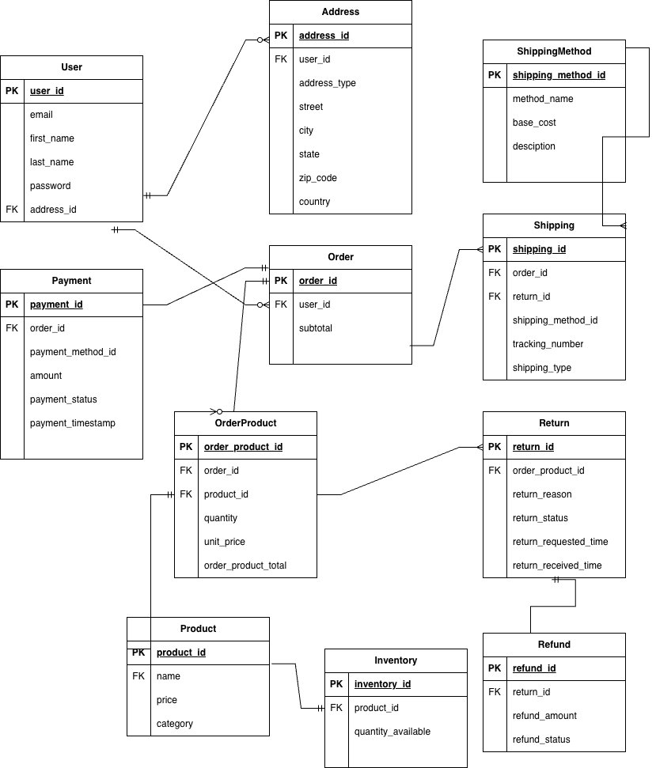

# Q1 Function Database Decision

## Relational (MySQL)

### User
- **Database:** MySQL
- **Type:** Relational
- **Reason:** User profiles, addresses, and payment methods follow a fixed schema and require strong consistency and foreign key relationships.

### Order
- **Database:** MySQL
- **Type:** Relational
- **Reason:** Orders, order items, payments, and shipping require ACID transactions to prevent partial or inconsistent states.

### Shipping
- **Database:** MySQL
- **Type:** Relational
- **Reason:** Structured shipping methods, rates, and delivery tracking.

### Inventory
- **Database:** MySQL
- **Type:** Relational
- **Reason:** Stock levels need strong consistency to prevent overselling and ensure accurate quantity updates.

### Payment
- **Database:** MySQL
- **Type:** Relational
- **Reason:** Financial transactions require strict ACID guarantees and transaction rollbacks.

### Return
- **Database:** MySQL
- **Type:** Relational
- **Reason:** Refunds link tightly to original orders and payment transactions, requiring consistent joins and transactional integrity.

## Non-Relational

### Product Catalog
- **Database:** MongoDB
- **Type:** Document Store (Non-relational)
- **Reason:** Different product types have flexible and evolving attributes that fit better in JSON documents than rigid relational schemas.

### Shopping Cart
- **Database:** Redis
- **Type:** Key-Value Store (Non-relational)
- **Reason:** Carts require extremely fast reads/writes, TTL expiration, and simple key-based lookup.

### Session
- **Database:** Redis
- **Type:** Key-Value Store (Non-relational)
- **Reason:** Session data is temporary and frequently accessed, benefiting from in-memory speed and automatic expiration.

### User Behavior
- **Database:** MongoDB
- **Type:** Document Store
- **Reason:** Behavior events are high-volume, append-only, and timestamped, better suited for flexible storage.

# Q2 ERD

# Q3
I keep a small Product table in MySQL for attributes that are common to all products (product_id, name, base_price, category, etc.), and then store the category-specific attributes in a document store like MongoDB.

# Q4
I will store the session state in a fast, non-relational key-value store such as Redis. Whenever a user visit the site, the server will issue a session token, which has the session data as value.

# Q5

# Q6

# Q7

# Q8
Data that benefits most from in-memory storage includes sessions and shopping carts because they change often and require very fast access. I would store these in Redis and keep a small identifier (like a session_id or user_id) in the user’s cookie. When the user comes back, the server reads that identifier and retrieves the latest session or cart data from Redis or MySQL.

# Q9

# Q10
## Queries that graph database better than relational
Graph databases can answer multi-step relationship queries much faster than relational joins. For examples, we can form a  "finding products that are often bought together" "guess what you like" graph database by studying user purchase behavior.

## Graph model design
Nodes:
- User
- Product
- Category

Relationships:
- (:User)-[:VIEWED]->(:Product)
- (:User)-[:ADDED_TO_CART]->(:Product)
- (:User)-[:PURCHASED]->(:Product)
- (:Product)-[:IN_CATEGORY]->(:Category)
- (:Product)-[:BOUGHT_WITH]->(:Product)

