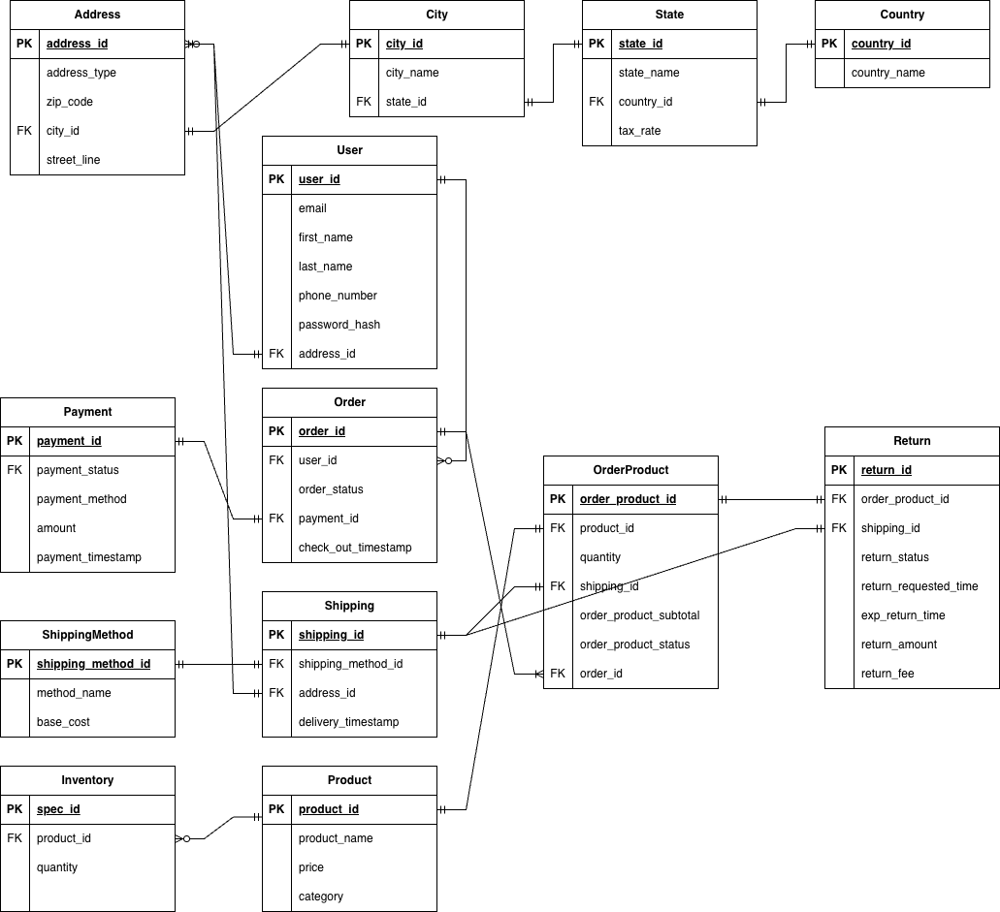

# Q1 Function Database Decision

## Relational (MySQL)

### User
- **Schema:** PK: `user_id` | Attributes: `email`, `first_name`, `last_name`, `phone_number`, `password_hash` | FK: `address_id` → Address
- **Reason:** Fixed structured fields (email, names, phone) align with SQL's predefined schema for efficient storage and validation.

### Address/City/State/Country
- **Address:** PK: `address_id` | Attributes: `address_type`, `zip_code`, `street_line` | FK: `city_id` → City
- **City:** PK: `city_id` | Attributes: `city_name` | FK: `state_id` → State  
- **State:** PK: `state_id` | Attributes: `state_name`, `tax_rate` | FK: `country_id` → Country
- **Country:** PK: `country_id` | Attributes: `country_name`
- **Reason:** Hierarchical geographic structure with consistent fields matching SQL's rigid schema requirements.

### Order
- **Schema:** PK: `order_id` | Attributes: `order_status`, `check_out_timestamp`, `session_id`, `cart_id` | FK: `user_id` → User, `payment_id` → Payment
- **Reason:** Transaction-critical workflows requiring ACID compliance. Enhanced with session_id/cart_id for conversion analysis.

### OrderProduct
- **Schema:** PK: `order_product_id` | Attributes: `quantity`, `order_product_subtotal`, `order_product_status` | FK: `product_id` → Product, `shipping_id` → Shipping, `order_id` → Order
- **Reason:** Uses composite foreign keys (order_id → Order.order_id, product_id → Product.product_id) to enforce data validity, ensuring no order items reference non-existent orders or products. Supports efficient cross-table aggregation (e.g., calculating total items per order) via SQL’s JOIN and GROUP BY clauses.


### Payment
- **Schema:** PK: `payment_id` | Attributes: `payment_method`, `amount`, `payment_timestamp`, `payment_status`
- **Reason:** Financial data requiring strict consistency and ACID transactions to prevent payment discrepancies.

### Shipping/ShippingMethod
- **Shipping:** PK: `shipping_id` | Attributes: `delivery_timestamp` | FK: `shipping_method_id` → ShippingMethod, `address_id` → Address
- **ShippingMethod:** PK: `shipping_method_id` | Attributes: `method_name`, `base_cost`
- **Reason:** Structured logistics fields benefiting from SQL indexing for fast status tracking queries.


### Return
- **Schema:** PK: `return_id` | Attributes: `return_status`, `return_requested_time`, `exp_return_time`, `return_amount`, `return_fee` | FK: `order_product_id` → OrderProduct, `shipping_id` → Shipping
- **Reason:** Fixed structure requiring consistent joins and transactional integrity for return processing.

### Product
- **Schema:** PK: `product_id` | Attributes: `product_name`, `price`, `category`
- **Reason:** Core product attributes requiring consistency for inventory management and order processing.

### Inventory
- **Schema:** PK: `spec_id` | Attributes: `quantity` | FK: `product_id` → Product
- **Reason:** ACID transactions required to prevent overselling during concurrent inventory operations.

## Non-Relational

### Product Catalog & Inventory
- **Database:** MongoDB + MySQL (Hybrid)
- **Type:** Document Store + Relational
- **Reason:** 
  - MySQL stores core product data (Product table) and inventory tracking (Inventory table: spec_id PK, product_id FK, quantity) for consistency
  - MongoDB stores flexible, category-specific attributes (size, color, material) that vary by product type
- **MySQL Tables:** `product`, `inventory (spec_id, product_id, quantity)` 
- **MongoDB Database:** `ecommerce_catalog`  
- **MongoDB Collection:** `product_specs`

```json
[
  {
    "spec_id": "12345_S_blue",
    "product_id": 12345,
    "attributes": {"size": "S", "color": "blue", "material": "cotton"}
  },
  {
    "spec_id": "67890_BT53",
    "product_id": 67890, 
    "attributes": {"brand": "Sony", "connection": "Bluetooth 5.3", "battery": "30h"}
  },
  {
    "spec_id": "23456_ceramic",
    "product_id": 23456,
    "attributes": {"material": "ceramic", "color": "white/gray", "height": "45cm"}
  }
]
```


### Shopping Cart
- **Database:** Redis + MongoDB (Hybrid)
- **Type:** Key-Value Store + Document Store
- **Reason:** 
  - Redis handles real-time session/cart operations for speed
  - MongoDB stores cart sessions for global analytics and conversion tracking

**Redis Key:** for guest users: `cart:{session_id}` or for logged-in users: `cart:user:{user_id}`

```json
{
  "cart_id": 8888,
  "items": [
    {
      "product_id": 12345,
      "spec_id": "67890_BT53",
      "quantity": 2          
    }
  ],
  "total_items": 2,
  "updated_at": "2025-11-25T16:40:00Z"
}
```

**MongoDB Database:** `ecommerce_events`  
**MongoDB Collection:** `cart_sessions`

```json
{
  "cart_id": 8888,
  "session_id": 123456,
  "user_id": 123,
  "items": [
    {
      "product_id": 12345,
      "spec_id": "12345_S_black",
      "quantity": 2,
      "added_at": "2025-11-25T16:40:00Z"
    }
  ],
  "created_at": "2025-11-25T16:00:00Z",
  "last_updated": "2025-11-25T16:40:00Z",
  "is_converted_to_order": false,
  "order_id": null
}
```


### Session
- **Database:** Redis
- **Type:** Key-Value Store (Non-relational)
- **Reason:** Session data is temporary and frequently accessed, benefiting from in-memory speed and automatic expiration.

**Key:** `session:{session_id}`

```json
{
  "device_type": "desktop",
  "user_id": 123,
  "created_at": "2025-11-25T15:00:00Z",
  "last_activity": "2025-11-25T16:55:00Z"
}
```


### User Behavior
- **Database:** MongoDB
- **Type:** Document Store
- **Reason:** Behavior events are high-volume, append-only, and timestamped, better suited for flexible storage.

**Database name:** `ecommerce_events`  
**Collection:** `user_events`

```json
{
  "user_id": 123,
  "session_id": 123456,
  "event_type": "view",
  "product_id": 12345,
  "search_term": null,
  "device_type": "mobile",
  "timestamp": "2025-11-25T16:10:00Z"
}
```

**Note:** Event types include: `view`, `click`, `search`, `add_to_cart`, `purchase`

### Cart Analytics
- **Database:** MongoDB
- **Type:** Document Store  
- **Reason:** Tracks cart sessions for conversion analysis and global shopping behavior statistics

**Database name:** `ecommerce_events`  
**Collection:** `cart_sessions`

```json
{
  "cart_id": 8888,
  "session_id": 123456, 
  "user_id": 123,
  "items": [
    {
      "product_id": 12345,
      "spec_id": "12345_S_black",
      "quantity": 2,
      "added_at": "2025-11-25T16:40:00Z"
    }
  ],
  "created_at": "2025-11-25T16:00:00Z",
  "last_updated": "2025-11-25T16:40:00Z", 
  "is_converted_to_order": false,
  "order_id": null
}
```


# Q2 ERD


# Q3
I keep a small Product table in MySQL for attributes that are common to all products (product_id, name, price, category, etc.), and then store the category-specific attributes in a document store like MongoDB. In addition, we introduced 'spec_id' to distinguish different attributes of products

# Q4

To handle user sessions, I separate two ideas: **who the user is** and **what device they are using**.

And I utilize different database to handle different data.
* **Redis** gives very fast access to active sessions and carts.
* **MySQL** keeps long-term records and makes data survive across devices and time.

## 1. User vs Session

* **User ID:** This is the long-term identity stored in MySQL. It is the same across all devices.
* **Session ID:** This is a short-term token stored in a cookie on each device.
  Every device gets its own session ID. I store the actual session data in Redis.

## 2. Guest vs Logged-In

* **Guest users** get a new session ID when they first visit the site. Their cart and recent activity are tied to the session ID stored in Redis.
* When the user **logs in**, I attach the session to their **user ID** so it becomes part of their account.

## 3. Using the Website on Multiple Devices

If the same user logs in on another device (for example, phone + laptop):

* The new device gets a new session ID.
* As soon as they log in, the server loads their saved cart and session info from MySQL.
* Redis is updated so both devices now point to the *same* user-level cart.
* This means the user sees the **same cart** across all devices.

## 4. Multiple Shopping Sessions Over Time

* Redis stores recent session data and cart data for fast access.
* I also save important session info into MySQL occasionally (such as abandoned carts).
  This helps with analytics and makes sure nothing is lost if Redis resets.

## 5. Merging Carts

If someone adds items as a **guest** and then logs in:

1. I take the guest cart (from the session ID).
2. I take the user's saved cart (from their user ID).
3. I merge them together.
4. The merged cart becomes the new "official" cart for that user.

# Q5
## Denormalization for Performance: Order Totals

I denormalized the Order / OrderProduct tables by storing pre-computed totals:

- `order_product_subtotal` on OrderProduct
- `order_total` on Order

These values can be derived from normalized fields (unit_price, quantity, tax, shipping), but storing them improves performance.

### Why Denormalize

Order pages are read far more often than orders are written.
Pre-computing totals avoids repeated JOINs and aggregations each time an order is viewed, giving much faster reads.

### Trade-offs

**Read Benefits**
- O(1) access to totals
- No re-aggregation or per-line calculations
- Faster reporting and order history queries

**Write/Consistency Costs**
- Totals must be updated atomically during checkout
- Risk of inconsistency if computations fail
- Updates are more complex if line items change

**Storage Costs**
- Some redundant data is stored

### Mitigation

Use transactions during checkout and periodic validation jobs to ensure totals stay consistent.

# Q6
## Data Flow Between Databases

### Flow 1: MySQL --> MongoDB (Product Catalog Sync)
- **What flows:** Basic product info (id, name, price, category) are copied from MySQL into MongoDB for flexible attributes like sizes, colors, materials.
- **Freshness:** Synced every 2–5 minutes. Small delays are acceptable.
- **Fallback:** If MongoDB is down, basic product data still available from MySQL.

### Flow 2: Frontend --> MongoDB (User Behavior Events)
- **What flows:** Every view, click, search, or add-to-cart event saved in MongoDB's `user_events` collection.
- **Freshness:** Events appear within seconds for "recently viewed" and recommendations.
- **Fallback:** If MongoDB unavailable, events can be safely dropped. Shopping still works via MySQL.

### Flow 3: Frontend --> Redis (Sessions and Carts)
- **What flows:** Session data (`session_id`, `user_id`) and shopping cart items for real-time operations
- **Freshness:** Real-time (milliseconds). Users must see cart changes immediately.
- **Fallback:** If Redis restarts, session data lost but can be recovered from MongoDB cart analytics or rebuilt from user behavior.

### Flow 4: Redis --> MongoDB (Cart Analytics Tracking)
- **What flows:** Cart session data from Redis to MongoDB's `cart_sessions` collection for analytics
- **Timing:** 
  - Cart create/update → upsert MongoDB cart_sessions (is_converted_to_order=false)
  - User activity tracking for conversion analysis
- **Freshness:** Near real-time (within seconds of cart changes)
- **Fallback:** If MongoDB unavailable, Redis continues operating. Analytics data can be backfilled later.

### Flow 5: Redis --> MySQL (Checkout and Cart Conversion Tracking)
- **What flows:** 
  - Cart data written to MySQL as permanent Order/OrderItem/Payment records during checkout
  - Order table enhanced with session_id/cart_id for conversion analysis
  - MongoDB cart_sessions updated: is_converted_to_order=true, order_id=new_order_id
- **Freshness:** Checkout writes are immediate.
- **Fallback:** If snapshot fails, Redis holds recent cart. Orders and accounts remain safe.

### Flow 6: MongoDB --> MySQL (Reporting Tables)
- **What flows:** Aggregated metrics (daily views, search counts, user activity) from MongoDB `user_events` into MySQL reporting tables.
- **Freshness:** Updated hourly or nightly.
- **Fallback:** If batch job fails, older summary data remains. Core shopping functions unaffected.


# Q7

## Data Consistency and Integrity Challenges

### 1. Keeping Data Consistent Across Databases

**Problem:** Same data appears in multiple places (e.g., product info in both MySQL and MongoDB), causing mismatches when updates fail.

**Fix:**
- Make MySQL the main source of truth
- Use ETL jobs to sync MySQL --> MongoDB and MongoDB --> MySQL (reporting)
- Add retry logic for failed updates
- Treat MongoDB and Redis as helper layers, not authoritative

### 2. Redis Volatility (Data Can Disappear)

**Problem:** Redis is in-memory, so sessions or carts may be lost if Redis restarts or evicts keys.

**Fix:**
- Add TTL to sessions and carts
- Save carts to MySQL during checkout
- Treat Redis as a cache, not permanent storage

### 3. MongoDB Schema Drift

**Problem:** MongoDB documents can slowly become inconsistent (missing fields, different field names).

**Fix:**
- Define simple JSON field rules for each collection
- Add basic validation before inserting documents
- Use occasional cleanup scripts to fix old documents


# Q8
Data that benefits most from in-memory storage includes sessions and shopping carts because they change often and require very fast access. I would store these in Redis and keep a small identifier (like a session_id or user_id) in the user’s cookie. When the user comes back, the server reads that identifier and retrieves the latest session or cart data from Redis or MySQL.

# Q9

I will use **MongoDB** to add a separate behavior-tracking layer alongside the normal e-commerce database to track user shopping behavior. MongoDB is flexible and doesn't need strict schema, in case more behaviors need to be added.

### What I Track
* Product views, clicks, search queries
* Time spent on pages
* Add-to-cart and purchase events (as behavior, not official orders)

**Database:** `ecommerce_events`  
**Collection:** `user_events`

```json
{
  "user_id": 123,
  "session_id": 123456,
  "event_type": "view",
  "product_id": 12345,
  "timestamp": "2025-11-25T16:10:00Z"
}
```

**Indexes:** `user_id + timestamp` and `product_id + event_type` for quick lookups.

### Connecting MongoDB to MySQL
MongoDB stores **raw event stream**, MySQL stores **summaries**.

ETL job (hourly/nightly):
1. Read events from MongoDB
2. Aggregate data
3. Write to MySQL tables: `daily_product_views`, `top_search_terms`, `user_activity_summary`

### Connecting Redis to MongoDB
Redis stores session and cart info. Each frontend action uses Redis `session_id` to attach correct user info before writing events to MongoDB.

Redis is used like a fast lookup table to enrich the event before saving it.

**Example:**

User performs: "view product 12345"

Backend process:
1. Check Redis: "which user/session did this come from?"
2. Write enriched behavior event to MongoDB:

```json
{
  "user_id": 123,
  "session_id": 123456,
  "event_type": "view",
  "product_id": 12345,
  "timestamp": "2025-11-25T16:10:00Z"
}
```

# Q10
## Queries that graph database better than relational
Graph databases can answer multi-step relationship queries much faster than relational joins. For examples, we can form a  "finding products that are often bought together" "guess what you like" graph database by studying user purchase behavior.

## Graph model design
Nodes:
- (User {user_id, name})
- (Product {product_id, name, category})
- (Category {category})

Relationships:
- (:User)-[:VIEWED]->(:Product)
- (:User)-[:ADDED_TO_CART]->(:Product)
- (:User)-[:PURCHASED]->(:Product)
- (:Product)-[:IN_CATEGORY]->(:Category)
- (:Product)-[:BOUGHT_WITH]->(:Product)


